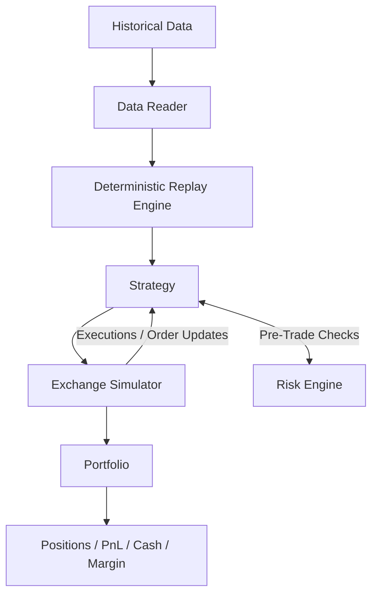

# UltraBacktest

### Deterministic Event-Driven Backtesting Infrastructure for Quantitative Research

UltraBacktest is a high-performance **C++20 backtesting engine** for systematic trading research. It is designed around deterministic event replay, explicit exchange simulation, low-overhead strategy execution, and portfolio/risk accounting.

The objective is not simply to process historical data quickly. It is to provide a controlled simulation environment in which a researcher can evaluate a strategy under explicit execution and risk assumptions.

> **Research → Simulation → Validation → Risk Analysis**

---

## Architecture



UltraBacktest separates the **market-data clock**, **strategy logic**, **execution simulation**, **risk controls**, and **portfolio state**. This keeps research assumptions explicit and makes individual components independently testable.

---

## Core Components

### Deterministic Replay Engine

The replay engine dispatches historical market events in a deterministic sequence.

- Tick/trade event replay
- Deterministic event ordering
- Low-overhead event dispatch
- Reproducible strategy runs
- Designed for large historical datasets

Determinism is central to the research workflow: the same data, configuration, and strategy should produce the same simulated sequence.

### Exchange Simulator

The exchange simulator provides the execution boundary between a strategy and the simulated market.

It models:

- Order submission and cancellation
- Matching behavior
- Execution events
- Configurable latency assumptions
- Queue-position effects

This is important because a backtest that only evaluates signals at historical prices can materially overstate executable performance.

### Strategy Interface

Strategies interact with the engine through a low-level interface receiving market events and submitting orders through the simulated exchange.

This creates a clean separation between:

```text
Market Data
     ↓
Strategy Logic
     ↓
Order Intent
     ↓
Exchange Simulation
     ↓
Execution
     ↓
Portfolio State
```

### Risk Engine

Risk checks operate around the strategy/execution boundary.

The current architecture supports pre-trade and post-trade risk evaluation so that a strategy can be tested under defined trading constraints rather than unconstrained signal generation.

### Portfolio

The portfolio layer tracks the financial state generated by simulated execution:

- Positions
- Cash
- PnL
- Margin
- Order/execution state

This provides the accounting layer required to turn individual fills into portfolio-level performance.

### Data Readers

The data interface supports multiple ingestion approaches:

- CSV
- Binary formats
- In-memory datasets

The abstraction separates storage/ingestion from the replay engine, allowing the same simulation pipeline to operate on different data sources.

---

## Performance

UltraBacktest is optimized for high-throughput historical replay so that researchers can iterate rapidly over large event sets.

### Replay benchmark

**Benchmark environment:** 8-core CPU, 1.89 GHz.

| Benchmark | Events | Wall Time | CPU Time | Throughput |
|---|---:|---:|---:|---:|
| `BM_ReplayEngine_Overhead` | 10,000,000 | 87.1 ms | 82.3 ms | **121.38M events/sec** |

The benchmark measures replay-engine overhead using `benchmark::DoNotOptimize` to prevent compiler elimination.

> **Important:** this is a raw replay-throughput benchmark. It should not be interpreted as 121M fully simulated strategy executions per second. Strategy complexity, exchange simulation, order-book state, risk checks and portfolio accounting add workload beyond the measured replay path.

### Critical-path design

The engine emphasizes:

- Preallocated state
- Value-oriented event processing
- Minimal dynamic allocation during replay
- Cache-conscious data layouts
- Constant-time routing between major engine components

---

## Complexity & Scaling

Historical event replay is fundamentally an **O(N)** process with respect to the number of events.

For the current architecture:

- Dataset processing scales approximately linearly with event count.
- Engine state is bounded by active simulation state rather than the entire historical dataset.
- Strategy complexity determines additional computational cost.
- Routing between strategy and exchange components is designed to remain constant-time.

For in-memory datasets, memory consumption is dominated by the event dataset itself. A 10-million-event dataset currently requires approximately **300–400 MB** depending on event representation and architecture alignment.

Streaming readers can bound memory usage by buffering only the required working set.

---

## Execution Realism

UltraBacktest is designed around the idea that **signal accuracy is not the same as executable performance**.

A quantitative backtest should account for the mechanics between a signal and a portfolio return:

```text
Signal
  ↓
Order Decision
  ↓
Latency
  ↓
Queue Position
  ↓
Matching
  ↓
Fill
  ↓
Fees / Costs
  ↓
Position
  ↓
PnL
```

The exchange simulator provides the foundation for extending this model toward more realistic execution-cost and market-impact research.

---

## Reproducibility

A research run should be reproducible from its inputs rather than dependent on hidden state.

Recommended research configuration:

```text
Dataset
+ Strategy
+ Execution Model
+ Risk Configuration
+ Simulation Parameters
        ↓
Deterministic Run
        ↓
Performance & Risk Statistics
```

This makes the engine suitable for systematic comparison of strategies, execution assumptions and parameter sets.

---

## Repository Structure

```text
Stratergy-tester/
├── ...                    # Core engine and simulation components
├── tests/                 # Unit tests
├── benchmarks/            # Performance benchmarks
├── CMakeLists.txt
└── README.md
```

---

## Build

### Requirements

- CMake 3.15+
- C++20-compatible compiler
- GCC, Clang or MSVC
- Ninja (optional)

### Release build

```bash
mkdir build
cd build
cmake .. -G "Ninja" -DCMAKE_BUILD_TYPE=Release
cmake --build .
```

### Tests

```bash
./build/tests/ultrabacktest_test_event
./build/tests/ultrabacktest_test_portfolio
```

### Benchmark

```bash
./build/benchmarks/bench_replay
```

---

## Engineering Trade-offs

UltraBacktest intentionally balances three competing requirements:

| Requirement | Design Priority |
|---|---|
| Throughput | High |
| Determinism | High |
| Execution realism | Extensible |

A faster backtest is useful only when the simulation remains sufficiently faithful to the assumptions being tested.

The architecture therefore keeps execution semantics explicit rather than hiding them behind a high-level research API.

---

## Research Roadmap

Potential extensions include:

- Full limit-order-book replay
- More granular queue-position modelling
- Transaction-cost and fee models
- Slippage models
- Market-impact models
- Latency distributions and tail analysis
- Multi-asset portfolio simulation
- Walk-forward validation
- Monte Carlo resampling
- Microstructure-aware execution research
- Integration with live market-data infrastructure

---

## Role in the Quantitative Stack

UltraBacktest is the **research and simulation layer** of a broader quantitative systems stack:

```text
                 Market Data
                      │
                      ▼
             Market Microstructure
                      │
                      ▼
                  Hypothesis
                      │
                      ▼
                UltraBacktest
                      │
          ┌───────────┴───────────┐
          ▼                       ▼
     Statistical              Risk Analysis
     Validation                    │
          │                       │
          └───────────┬───────────┘
                      ▼
                Execution Layer
                      │
                      ▼
                   UltraLOB
```

UltraBacktest provides the controlled environment for answering a fundamental research question:

> **Does a strategy remain viable once market mechanics, execution assumptions and risk constraints are introduced?**

---

## License

See the repository license for terms of use.
