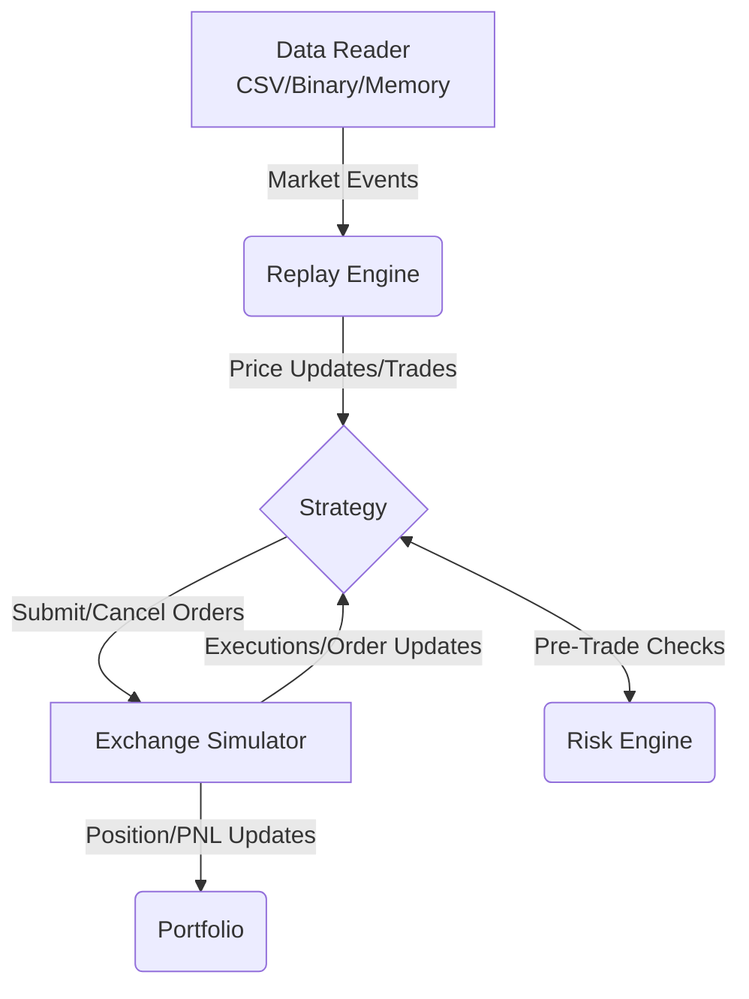

# UltraBacktest

UltraBacktest is a high-performance, ultra-low latency C++ backtesting engine designed for quantitative trading strategies. It focuses on deterministic execution, minimal memory overhead, and extremely fast event processing.

## Architecture

At the core of UltraBacktest is an event-driven architecture that accurately simulates market micro-structure.



### Key Components

- **Replay Engine**: The heart of the backtester. Deterministically dispatches historical market data events.
- **Exchange Simulator**: Accurately simulates order matching, latency, and queue positions to give realistic fill results.
- **Strategy Interface**: A low-level API where your trading logic resides. It receives market events and interacts with the exchange and portfolio.
- **Risk Engine**: Pre-trade and post-trade risk evaluations to ensure strategies operate within defined limits.
- **Portfolio**: Tracks positions, PnL, cash, and margin across the strategy's lifecycle.
- **Data Reader**: Extendable data adapters to read market data from CSVs, binary formats, or directly from memory.

## Benchmarks & Performance Metrics

UltraBacktest is heavily optimized for speed to allow researchers to iterate over massive datasets in seconds. 

Below are the benchmark results measured on an 8-core CPU (1.89 GHz) using `benchmark::DoNotOptimize` to prevent compiler elision. 

| Benchmark | Events | Time | CPU Time | Throughput |
| :--- | :--- | :--- | :--- | :--- |
| **BM_ReplayEngine_Overhead** | 10,000,000 | 87.1 ms | 82.3 ms | **121.38 Million events / sec** |

### Key Performance Highlights:
- **120+ Million Events per Second**: Single-threaded raw throughput processing ticks and trades.
- **Zero-Allocation Critical Path**: The core event loop uses pre-allocated pools and value-semantics to avoid dynamic memory allocation (`malloc`/`new`) during replay.
- **Cache Locality**: Contiguous memory layouts for events ensure maximum L1/L2 cache hit rates.

## Memory Usage

- **Processing Overhead**: The engine itself maintains an $O(1)$ memory footprint during replay, regardless of the dataset size. State is strictly limited to active orders, positions, and current market snapshots.
- **Data Footprint**: Memory usage scales linearly based entirely on the Data Reader in use. When using the `MemoryReader`, a 10-million event dataset consumes approximately ~300-400 MB of RAM (depending on the exact event struct size and architecture alignment). When using streaming readers (e.g. CSV/Binary), memory is bounded by the buffer size.

## Scaling Test

The architecture scales predictably and linearly.
- **Data Scaling**: Processing time increases exactly linearly $O(N)$ with the number of events. Moving from 1 Million to 10 Million events maintains the same average processing time per event (approx ~8 nanoseconds per event overhead).
- **Strategy Complexity**: As strategies introduce more complex order books and signal generation logic, the overhead scales based on algorithmic complexity, but the engine guarantees $O(1)$ routing overhead between the strategy and exchange simulator.

## Getting Started

### Prerequisites
- CMake 3.15+
- A C++20 compatible compiler (GCC, Clang, MSVC)
- Ninja (optional, but recommended)

### Build Instructions

```bash
mkdir build
cd build
cmake .. -G "Ninja" -DCMAKE_BUILD_TYPE=Release
cmake --build .
```

### Running Tests and Benchmarks

To run the unit tests:
```bash
./build/tests/ultrabacktest_test_event
./build/tests/ultrabacktest_test_portfolio
```

To run the performance benchmark:
```bash
./build/benchmarks/bench_replay
```
